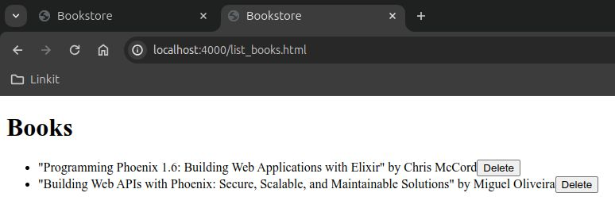

# Bookstore

Bookstore is an Elixir application using Phoenix web framework. This application will allow users to view books, add new books, update existing books, and delete books.

## Usage

To start your Phoenix server:

  * Run `mix setup` to install and setup dependencies
  * Start Phoenix endpoint with `mix phx.server` or inside IEx with `iex -S mix phx.server`

Add/Edit Books: [`localhost:4000/add_edit_book.html`](http://localhost:4000/add_edit_book.html) 
List/Delete Books: [`localhost:4000/list_books.html`](http://localhost:4000/list_books.html) 
List JSON: [`localhost:4000/api/books`](http://localhost:4000/api/books)

