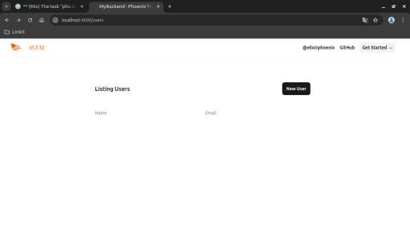
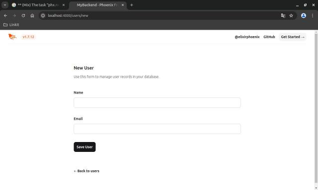

# MyBackend

MyBackend is a simple Elixir backend application built using the Phoenix web framework. It provides CRUD (Create, Read, Update, Delete) operations for managing users.

## Usage

The application provides CRUD operations for managing users. You can perform the following actions:

* Create a new user
* View a list of users
* View details of a specific user
* Update user details
* Delete a user

You can interact with the user management interface by visiting [`localhost:4000/users`](http://localhost:4000/users) in your web browser.

To start your Phoenix server:

  * Run `mix setup` to install and setup dependencies
  * Start Phoenix endpoint with `mix phx.server` or inside IEx with `iex -S mix phx.server`

Now you can visit [`localhost:4000`](http://localhost:4000) from your browser.

Ready to run in production? Please [check our deployment guides](https://hexdocs.pm/phoenix/deployment.html).

## Learn more

  * Official website: https://www.phoenixframework.org/
  * Guides: https://hexdocs.pm/phoenix/overview.html
  * Docs: https://hexdocs.pm/phoenix
  * Forum: https://elixirforum.com/c/phoenix-forum
  * Source: https://github.com/phoenixframework/phoenix
